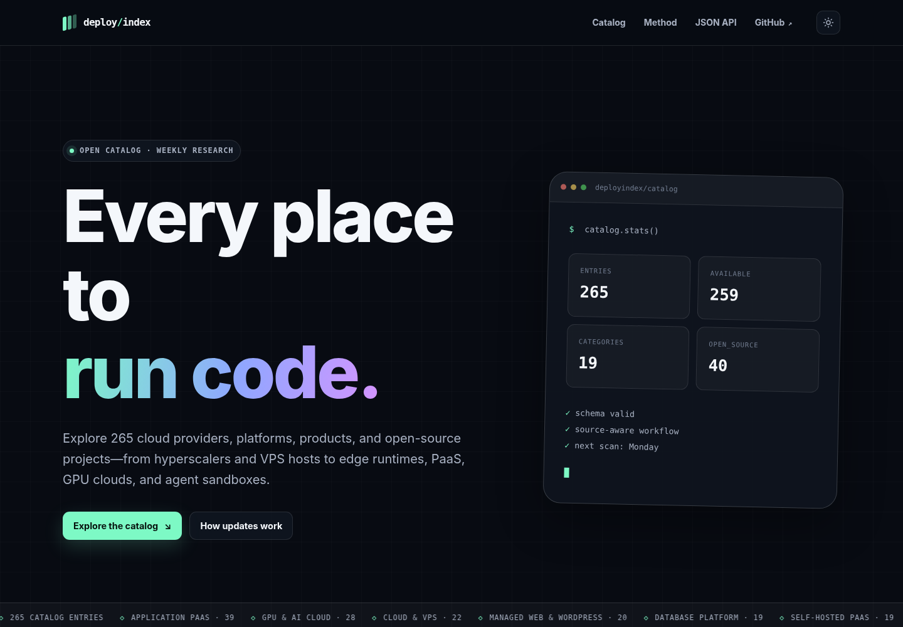

# DeployIndex

**Every place to run code.**

DeployIndex is a technical, searchable directory and transparent hosting recommendation engine covering cloud providers, application platforms, individual cloud products, edge runtimes, self-hosted PaaS projects, BYOC control planes, GPU/AI clouds, backend and database platforms, developer sandboxes, game hosting, managed web hosting, and discontinued platforms worth preserving historically.



## What is included

The initial broad seed contained **265 records** at launch — the catalog grows through weekly research pull requests, and `/catalog/stats.json` always carries the current count. The seed deliberately distinguishes:

- providers such as AWS, Azure, Google Cloud, Cloudflare, DigitalOcean, Akamai/Linode, Oracle Cloud, IBM Cloud, OVHcloud, Hetzner, Vultr, and Scaleway;
- products such as Lambda, Cloud Run, Workers, Azure Container Apps, DigitalOcean App Platform, Vercel Functions, and Kubernetes services;
- open projects such as Coolify, Dokploy, Dokku, Knative, OpenFaaS, Kubero, and Agones;
- newer platforms such as Fly.io, Railway, Northflank, Koyeb, bunny Magic Containers, Cloudflare Containers, Modal, E2B, Ravion, Defang, Leapcell, Sevalla, and Zerops;
- archived or transitioning products that should not vanish from historical links.

The seed is broad, not infallible. Records marked `confidence: seed` are explicitly awaiting source-by-source verification. Weekly automation is designed to improve that evidence over time.

## Architecture

The first version is intentionally static-first and provider-neutral:

```text
catalog/providers.json + recommendation-overrides.json
        │
        ├── deterministic validation
        ├── weekly web research → structured proposal → pull request
        ├── qualitative recommendation profiles
        └── zero-dependency Python build
                         │
                         └── dist/ (portable static site + recommender + public JSON API)
```

There is no required JavaScript framework, package manager, database, or hosted control plane. The generated site can run on Cloudflare Workers Static Assets, Vercel, Netlify, GitHub Pages, S3/object storage, nginx, or any ordinary web server.


## Hosting recommendation engine


`/recommend/` is a static, client-side matching tool over the full catalog. It asks about workload, deployment artifact, billing shape, starting-cost band, team expertise, operating model, traffic, protocol, state, geography, and strong requirements such as private networking, previews, scale-to-zero, open source, and GPUs.

The result is not a paid ranking. The engine:

- scores every currently available profile in the browser;
- exposes positive fit reasons and trade-offs;
- lets users weight ease, cost, predictability, control, portability, maturity, reach, and enterprise readiness;
- stores the complete configuration in a shareable URL;
- uses qualitative bands rather than unstable undated price quotes;
- publishes its generated profiles at `/catalog/recommendations.json`.

See [`docs/RECOMMENDER.md`](docs/RECOMMENDER.md) for the complete variable backlog, scoring model, and trust rules.

## Local development

Requirements:

- Python 3.11 or newer;
- Node.js only for the optional JavaScript syntax checks used by `make test`.

```bash
make test
make preview
```

Then open `http://localhost:8000`.

Direct commands:

```bash
python3 scripts/validate.py
python3 scripts/build.py
python3 scripts/check_site.py
python3 -m http.server 8000 --directory dist
```

## Catalog data and API

The source of truth is `catalog/providers.json`. Validation is enforced by the deterministic checks in `scripts/validate.py`; a descriptive JSON Schema is published at `catalog/schema.json` for consumers, and a unit test keeps its enums synchronized with the enforced constants.

The build publishes:

- `/catalog/providers.json`
- `/catalog/schema.json`
- `/catalog/stats.json`
- `/catalog/recommendations.json`
- `/catalog/pricing.json`
- `/recommend/`
- `/compare/`
- `/pricing/`
- `/providers/<slug>/`
- `/sitemap.xml`

Each record includes identity type, parent relationship, categories, capabilities, operating model, launch era, status, availability, open-source flag, source trail, verification date, confidence, and change note.

`/pricing/` and `/catalog/pricing.json` are a separate, hand-entered database pricing dataset — dated
observation rows joined to the catalog by slug, computed into reference-workload totals with explicit
`insufficient_data` semantics rather than partial sums. It currently covers 3 providers (Neon,
Supabase, PlanetScale) in USD / `us-east` only, and is never used in recommender scoring.

The reference workloads price a plan fee, storage, and egress only — **metered compute is not
included**, so the totals are not the cost of running a database, and a provider that folds compute
into a fixed plan fee looks more expensive than one that meters it separately. Every surface says so.
See [`pricing/README.md`](pricing/README.md) for the contributor rules.

## Weekly internet research

`.github/workflows/catalog-refresh.yml` runs each Monday and follows this pipeline:

1. validate the current catalog;
2. select a deterministic, category-balanced rotation of 45 existing entries;
3. search broadly for launches, new providers, rebrands, acquisitions, shutdowns, and product changes;
4. extract a strict JSON proposal through the OpenAI Responses API with web search;
5. deterministically reject duplicates, invalid categories, unsupported sources, broken parent relationships, and malformed records;
6. stage medium/high-confidence additions, ordinary metadata corrections, and verification timestamps;
7. **leave all status/shutdown/archive alerts and identity changes (name, URL, entity type) unapplied**;
8. rebuild and test the entire site;
9. open a pull request containing the proposal, evidence trail, generated diff, and review checklist.

The workflow never hard-deletes entries. A failed request is never treated as shutdown evidence.

### Configure the workflow

Add a repository Actions secret:

```text
OPENAI_API_KEY
```

Optionally add the Actions variable `OPENAI_MODEL`; it defaults to `gpt-5.6-luna`. The automation uses only the Python standard library and GitHub's built-in `gh` CLI.

Run a network-free end-to-end fixture locally:

```bash
make research-fixture
```

Run a real scan:

```bash
export OPENAI_API_KEY=...
python3 scripts/research.py
python3 scripts/apply_proposal.py catalog/proposals/YYYY-MM-DD.json
make test
```

## Human review policy

Automation can discover aggressively, but publication stays conservative.

- New entries need an official canonical URL and probable first-party evidence.
- Routine corrections can be staged automatically in a pull request.
- Shutdown, discontinuation, acquisition, migration, and archive decisions require manual review.
- Rebrands and canonical-URL changes (name, URL, entity type) are proposed but never applied automatically.
- Archived pages remain available for history and link stability.
- The weekly catalog research scan never touches pricing. A separate, hand-entered pricing dataset exists at `/pricing/` (see `pricing/README.md`); it has no automated research path yet.
- Affiliate ordering and paid placement are outside the neutral catalog model.

See the generated `/method/` page and `AGENTS.md` for the full operating contract.

## Deploy

Set these optional build variables:

```bash
export SITE_URL=https://your-domain.example
export REPOSITORY_URL=https://github.com/owner/repository
python3 scripts/build.py
```

Deploy `dist/`.

### GitHub Pages (what this repo deploys to)

`.github/workflows/deploy-pages.yml` builds and publishes on every push to `main`. It derives `SITE_URL` from the Pages URL itself, so a project site served from a subpath (`owner.github.io/repo`) works without configuration — the build prefixes every asset and link accordingly.

One manual step is needed once: set **Settings → Pages → Source** to "GitHub Actions".

Pages does not support custom response headers, so `site/_headers` has no effect there. The security headers that matter are also emitted as a `<meta http-equiv>` policy in every page; `_headers` still applies on hosts that read it, and adds `frame-ancestors`, which a meta policy cannot express.

### Cloudflare Workers Static Assets

Still supported, and `wrangler.jsonc`, `site/_headers`, and `.github/workflows/deploy-cloudflare.yml` are kept for it — but its push trigger is disabled so it does not race the Pages deploy. To use it instead, re-enable that trigger, remove `deploy-pages.yml`, and add secrets `CLOUDFLARE_API_TOKEN` and `CLOUDFLARE_ACCOUNT_ID` plus a repository variable `SITE_URL`.

```bash
export SITE_URL=https://your-domain.com
python3 scripts/build.py
npx wrangler@4 deploy
```

### Vercel

The included `vercel.json` sets the same build and output directory. Add the environment variables in project settings — `SITE_URL` is required: CI builds fail loudly without it so canonical URLs can never silently point at localhost.

### Netlify

The included `netlify.toml` sets the build and publish directory. Add the environment variables in site settings — `SITE_URL` is required: CI builds fail loudly without it so canonical URLs can never silently point at localhost.

## Working with coding agents

The repository contains `AGENTS.md` (the operating contract, also loaded by Claude Code via `CLAUDE.md`), deterministic commands, and fixture coverage so coding agents can safely inspect, edit, run, and review it.

From the repository directory:

```bash
codex
```

```bash
claude
```

Good first tasks:

```text
Review the repository and run make test. Then improve the homepage information architecture without changing the catalog schema.
```

```text
Add a comparison view for up to four selected deployment surfaces. Preserve static portability, URL-backed state, and accessibility.
```

```text
Review the weekly research pipeline for false-positive and prompt-injection risks. Add tests for every issue you find.
```

## License

MIT
