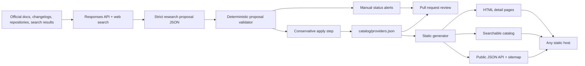

# Architecture

## Product boundary

DeployIndex is a directory and research system, not a hosting broker or benchmark leaderboard. Its core artifact is a portable, source-aware catalog of deployment surfaces.

The architecture keeps four concerns separate:

1. **Catalog truth** — structured records in version control.
2. **Research proposals** — model-assisted, source-linked observations that are not trusted until validated.
3. **Publication** — a deterministic static build.
4. **Review and governance** — Git diffs and pull requests, especially for destructive or reputationally sensitive changes.

## Components

## Why static-first

A directory containing hundreds or thousands of records does not inherently require a server-rendered application or operational database. Static generation provides:

- deployment to almost any provider represented in the directory;
- low operating cost and a small attack surface;
- inspectable source and generated output;
- fast detail pages and resilient public JSON;
- easy forks and migrations;
- a clean separation between research data and presentation.

A database or search service can be added later when user accounts, saved comparisons, very large catalogs, analytics, or complex faceting justify it. The JSON catalog should remain exportable even then.

## Catalog model

A record is one deployment surface:

- `provider` — company or broad cloud platform;
- `product` — separately selectable hosting/runtime product;
- `project` — open-source deployment software.

`parent_slug` models ownership or product families without conflating identities. Categories are facets rather than a rigid hierarchy. `primary_category` controls initial presentation; `categories` preserves multi-category discovery.

Status and availability are intentionally separate. A product can be `sunset` but still available to existing customers, or `transitioning` while generally available.

## Research trust boundary

The model never edits the catalog directly.

1. The current inventory and a weekly verification rotation are sent with search instructions.
2. The API must return a strict schema containing candidates, ordinary updates, status alerts, and active checks.
3. Deterministic code rejects malformed URLs, duplicate identities, missing parents, invalid facets, unsupported confidence, and records without probable primary evidence.
4. The conservative apply step stages only medium/high-confidence additions, ordinary corrections, and verification timestamps.
5. Status and shutdown alerts remain unapplied.
6. CI validates the resulting catalog and every generated page.
7. A human reviews the pull request and source trail.

This does not make model-assisted research infallible. It turns uncertain research into a bounded, inspectable change-management process.

## Threat model

Primary risks:

- malicious instructions embedded in searched pages;
- false shutdown or acquisition claims;
- duplicate products and rebrands;
- model-generated source URLs that do not support claims;
- compromised API or repository credentials;
- silent schema drift;
- generated HTML injection;
- directory monetization distorting neutral ordering.

Controls:

- web content is treated as untrusted evidence, never instructions;
- strict structured output plus deterministic validation;
- first-party source heuristics and manual review;
- no automatic deletion/status application;
- least-privilege GitHub permissions;
- HTML escaping in the generator;
- no HTML fields in catalog records;
- CI for schema, duplicate, link, fragment, syntax, and page-generation checks;
- no affiliate ranking in the catalog contract.

## Scaling path

The current design can scale substantially before requiring a rewrite:

1. Add richer records and more generated facets.
2. Produce a compact client-side search index.
3. Split the catalog into source files while generating one public JSON artifact.
4. Add historical snapshots and field-level citations.
5. Add benchmark and pricing datasets as separate dated schemas.
6. Introduce server-side search only when static indexes become measurably inadequate.
7. Add accounts, collections, submissions, or comments as isolated services rather than moving catalog truth into an opaque application database.
